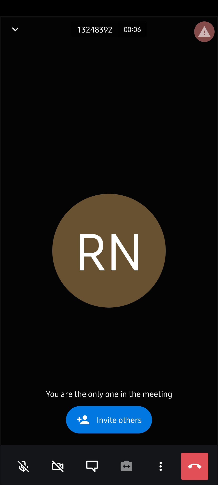

# Zoom Clone

Hello there.
This is a simple Zoom clone developed in flutter.
This app was developed according to the classes of:

Flutter & Firebase Tutorial: Build 5 Social Media Apps - UDEMY;

### Versions

- **Flutter**: 2.10.2
- **Dart**: 2.16.1

### Setup

Clone it in your machine:
```bash
git clone https://github.com/RodrigoNP3/Zoom_Clone.git
```

Dependecies:

```bash
dependencies:
  cupertino_icons: ^1.0.2
  firebase_core: ^1.13.1
  firebase_auth: ^3.3.9
  cloud_firestore: ^3.5.0
  google_sign_in: ^5.2.4
  jitsi_meet: ^4.0.0
  intl: ^0.17.0
```

Firebase Setup:

1 - Create a new firebase project in the firebase console;
You can deactivate the Google Analytics.

2 - Setup authentication by Google;

3 - Create a Firestore Database;

Change the rules from:

```bash
rules_version = '2';
service cloud.firestore {
  match /databases/{database}/documents {
    match /{document=**} {
      allow read, write: if
          request.time < timestamp.date(2022, 10, 31);
    }
  }
}
```

Change to:

```bash
rules_version = '2';
service cloud.firestore {
  match /databases/{database}/documents {
    match /{document=**} {
      allow read, write: if request.auth != null;
    }
  }
}
```

4 - Create an iOS app;

Apple bundle id:
com.example.zoomCloneTutorial

Download the GoogleService-Info.plist and put it in the Runner folder.
ios>Runner>GoogleService-Info.plist

In the info.plist, line 55, put your REVERSED_CLIENT_ID, you can find it in the GoogleService-Info.plist file,
ios>Runner>info.plist

You can skip the next iOS app creation steps.

5 - Create an Android app;

Android package name:
com.example.zoom_clone_tutorial

SHA1 signing certificate:

To get your SHA1 key you have to run this command in your terminal:
keytool -list -v -keystore ~\.android\debug.keystore -alias androiddebugkey -storepass android -keypass android

if it dosn't work you can try put the full path: C:\Users\YOUR-USER\.android...

Get the key and put it in the Android app creation.

Download the google-services.json and put it in the app folder.

android>app>google-services.json

You can skip the next Android app creation steps.

### Navigation


<table>
<thead>
<tr>
<th align="center">Login/Signup Screen</th>
<th align="center">Home Screen</th>
<th align="center">Meetings History Screen</th>


</tr>
</thead>
<tbody>
<tr>
  

  
<td align="center">
  <a target="_blank" rel="" href="images/login_signup_screen.jpg">
        

  </a></td>

  <td align="center">
  <a target="_blank" rel="" href="images/home_screen.jpg">
        

  </a></td>

 <td align="center">
  <a target="_blank" rel="" href="images/meetings_history_screen.jpg">
        

  </a></td>
  
  
<table>
<thead>
<tr>
<th align="center">Join Meeting Screen</th>
<th align="center">Call Screen</th>
<th align="center">Settings Screen</th>


</tr>
</thead>
<tbody>
<tr>
  

  
<td align="center">
  <a target="_blank" rel="" href="images/join_meeting_screen.jpg">
        

  </a></td>

  <td align="center">
  <a target="_blank" rel="" href="images/call_screen.jpg">
        

  </a></td>

 <td align="center">
  <a target="_blank" rel="" href="images/settings_screen.jpg">
        

  </a></td>

  
